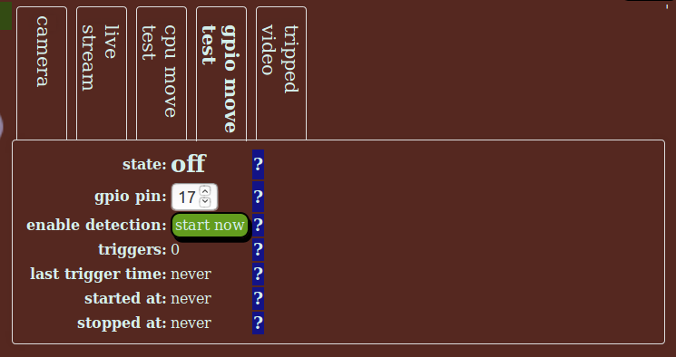

gpio detect
===========

This gpio detect tab allows use of a gpio port as a trigger, typically to trigger a video recording.

This enables a PIR sensor, a button or any other external hardware capable of interfacing to gpio to be used as a trigger.

gpio move fields
----------------

state
    Shows the current state of this stream. See :ref:`state field for details <common-field-state>`.

start now
    This button starts the gpio monitor if it is not running, and stops it if it is running. 

triggers
    The count of triggers in the current run of gpio input detection.

last trigger time
    The last (local) time a movement trigger happened. 

started at
    The local time the stream last started. See :ref:`started at field for details <common-field-started-at>`.

stopped at
    The local time the stream last stopped. See :ref:`stopped at field for details <common-field-stopped-at>`.
