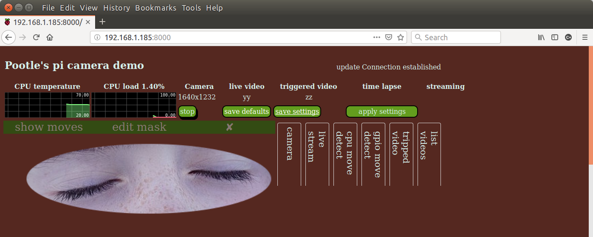
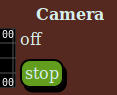

The main screen
===============

When you first open the web page, the screen, which will look something like this,

has 3 main areas:

* system summary and control - an overview of the overall system and some top level controls
* live view - when active - a default static image is shown initially
* tabbed panels with detailed controls for the various functions available

system summary and control
--------------------------

This area starts with two rolling graphs followed by top level controls:

* the current and recent CPU temperature - useful especially if your pi is in an enclosure
* the overall CPU utilisation - useful to make sure the Raspbery pi isn't getting too busy
* some further controls like the camera control (the rest is still under construction)

The Camera Control
------------------

The camera control includes a simple status field and a button.

The status field typically shows:

* off - if the camera is not running
* the resolution the camera is using if it us running (e.g. 1296x972)

The button - "stop" - stops the camera, but only if nothing else is active.
Changes to frame rate and overall resolution only take effect when the camera starts. If it is already running,
it needs to be stopped and restarted if either of these fields is changed.

Several aspects of the camera's operation can be controlled through the Camera tab (see tabbed panels below for the
detailed description of the Camera tab.

Live View
---------

The live view area is initially inactive. clicking anywhere on the static image will start live view. The live view's
controls are in the live stream tab (see tabbed panels below or the detailed description of the live stream tab.

The live view can be stopped at any time by clicking on the 'X' by the top right of the live view area.

Immediately above the live view is the 'edit mask' button that overlays the live view with a mask used by the CPU 
movement detection activity. This is explained in TBD.

Tabbed panels
-------------

There are more detailed control panels for the various functions in the tabbed panel area. Initially only the headings are
shown, clicking on any heading will display the relevant controls below the headings.

The following pages explain each of the tabs.