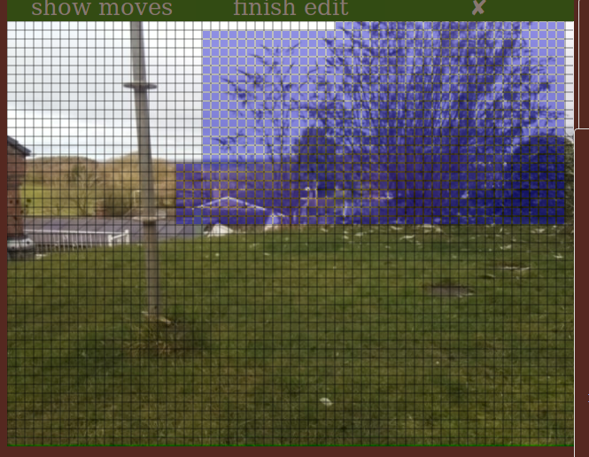

.. _mask-edit-top:

Mask editing
============

The cpu movement detection can use a mask to prevent triggering from specific areas of the view.

The mask is edited on the main web page using an overlay on the live view.

You can either create a new (blank) mask, or edit a previously saved mask. Use the

:ref:`cpu move tab field: use image mask <cpumovetab-use-image-mask>`

to set the mask file. If the mask file is 'off' a blank mask is used, if the mask file is valid 
the mask file is used as the initial mask to edit.

When the live view is active, clicking on 'edit mask'

overlays the live view with a grid. The overlay shows the individual cells of the mask. 'edit mask'
changes to 'finish edit'.

Use the mouse to turn on or off blocks of cells in the mask. Initially all cells are off (NOT masked).
Left click on any cell will enable that cell in the mask, and by holding the mouse down and dragging,
a rectangular area can be enabled in a single operation. Just release the mouse button to complete
an area. Masked areas have a blue wash applied.

To turn off a cell or block of cells hold the shift key down as the mouse button is clicked. (Shift can
be released after the mouse button is pressed).

Once editing is complete click on 'finish edit' above the live view. A small prompt screen appears.

Enter a name for the mask in the field provided and the mask is saved on the raspberry pi. Cancel or an
empty name discards the edited mask.

Once the mask has been saved, it can be selected on the

:ref:`cpu move tab field: use image mask <cpumovetab-use-image-mask>`